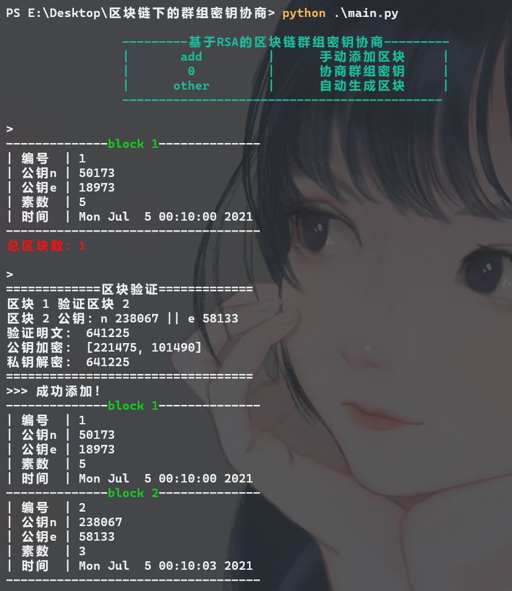
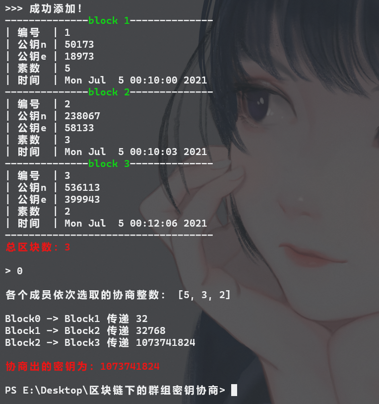

## 基于RSA算法的区块链下的Diffie-Hellman群组密钥协商

模拟区块链中的群组密钥协商过程，区块间加密与签名验证使用**RSA算法**，区块间的群组密钥协商使用**Diffie-Hellman密钥协商算法**，均是简单的密码算法，仅用于模拟过程。

区块链使用类实现，创建一个Block类，传入相应数据如公钥、私钥、素数、ID、事件等，即可实例化生成一个特定区块，生成新区块时上一个区块会使用新区块的信息加解密数据来验证新区快的合法性。

将私钥设定为私有属性`self.__priKey = priKey`，仅支持当前区块自己调用，其余数据设定为共有属性。

启动程序后，**直接回车**即可自动生成区块并验证，也可输入**add**手动添加区块，效果如下：

当输入**0**时则停止产生新区块，在所有已生成并验证的区块中协商一个可用于数据通信的群组密钥，采用Diffie-Hellman密钥协商算法，效果如下：

因仅用于验证因此RSA及其它算法中的素数均取值较小，减少计算时间。